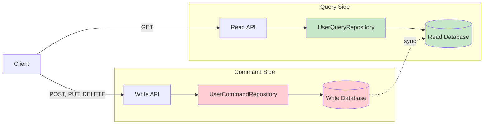
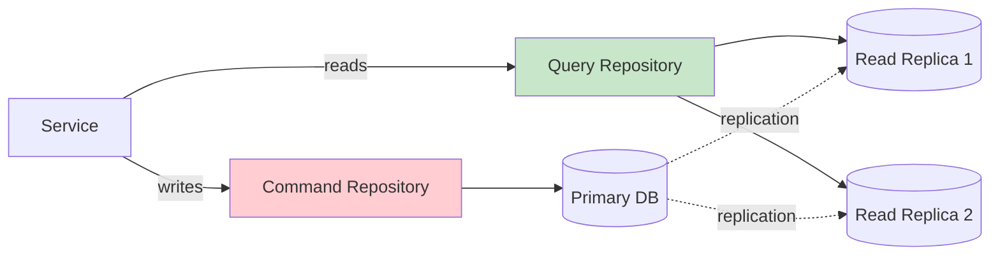
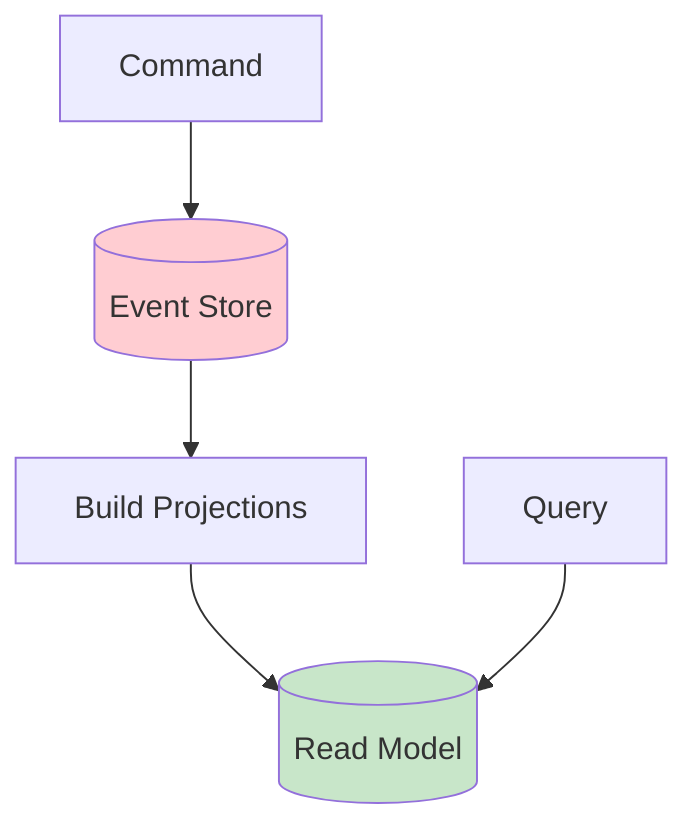
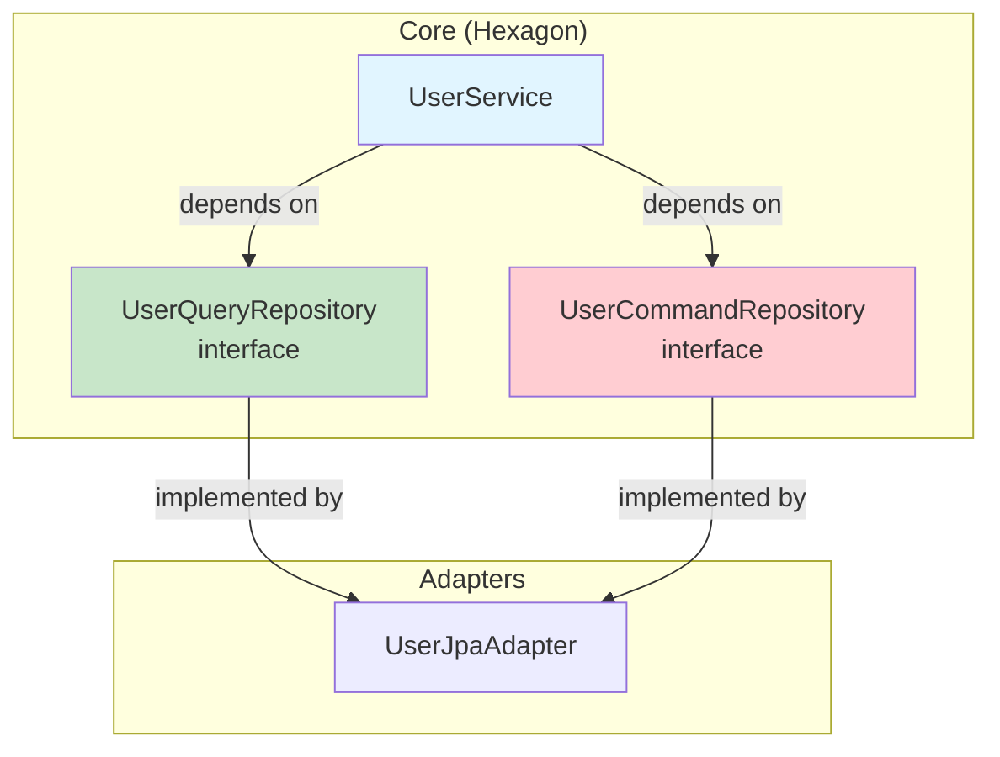

The User Management API implements **CQRS (Command Query Responsibility Segregation)** to separate read and write operations, enabling independent optimization and scaling strategies for each type of operation.

## What is CQRS?

CQRS is a pattern that separates operations into two categories:

- **Commands** - Operations that change state (Create, Update, Delete)
- **Queries** - Operations that read state without changing it (Read, List, Search)

By separating these concerns, each side can be optimized independently.



<Note>
In this implementation, both sides use the same PostgreSQL database, but the pattern enables future scaling by separating read replicas, adding caching, or even using different databases for reads vs writes.
</Note>

## Repository Separation

The core defines two distinct repository interfaces:

### UserCommandRepository (Write Operations)

Handles all state-changing operations:

```java
// src/main/java/com/fbaron/user/core/repository/UserCommandRepository.java
package com.fbaron.user.core.repository;

import com.fbaron.user.core.model.User;

/**
 * Outbound port (Driven Port) — write side of the CQRS split.
 * Separating commands from queries allows independent optimization
 * and scaling strategies.
 */
public interface UserCommandRepository {

    /**
     * Persists a new or updated user and returns the saved state.
     * Handles both creation and updates, including soft-delete (active=false).
     *
     * @param user domain model to persist
     * @return the saved User with its generated primary key populated
     */
    User save(User user);
}
```

See: `src/main/java/com/fbaron/user/core/repository/UserCommandRepository.java:10`

**Characteristics:**
- Single responsibility: persist changes
- Returns the saved entity (with generated IDs, timestamps)
- Used by: register, edit, remove operations

### UserQueryRepository (Read Operations)

Handles all read operations:

```java
// src/main/java/com/fbaron/user/core/repository/UserQueryRepository.java
package com.fbaron.user.core.repository;

import com.fbaron.user.core.model.User;
import java.util.List;
import java.util.Optional;
import java.util.UUID;

/**
 * Outbound port (Driven Port) — read side of the CQRS split.
 * The data module provides the concrete JPA implementation;
 * the core knows nothing about JPA.
 */
public interface UserQueryRepository {

    /**
     * Retrieves all persisted users ordered by creation date descending.
     */
    List<User> findAll();

    /**
     * Looks up a user by its primary key.
     */
    Optional<User> findById(UUID id);

    /**
     * Checks for username uniqueness before registration.
     */
    boolean existsByUsername(String username);

    /**
     * Checks for email uniqueness before registration or update.
     */
    boolean existsByEmail(String email);

    /**
     * Checks email uniqueness while excluding the user being updated.
     */
    boolean existsByEmailAndIdNot(String email, UUID id);
}
```

See: `src/main/java/com/fbaron/user/core/repository/UserQueryRepository.java:13`

**Characteristics:**
- Multiple read methods optimized for different use cases
- Existence checks for business rule validation
- No side effects - purely read-only
- Used by: findAll, findById, and validation logic

<Tip>
Notice the `existsByEmailAndIdNot` method - this is a query-side optimization for the "update user" validation logic, allowing efficient uniqueness checks without loading full entities.
</Tip>

## Usage in Business Logic

The service layer injects both repositories and uses them appropriately:

```java
// src/main/java/com/fbaron/user/core/service/UserService.java
public class UserService implements RegisterUserUseCase, GetUserUseCase, 
                                     EditUserUseCase, RemoveUserUseCase {
    private final UserQueryRepository userQueryRepository;  // Query side
    private final UserCommandRepository userCommandRepository;  // Command side

    // Constructor
    public UserService(UserQueryRepository userQueryRepository,
                       UserCommandRepository userCommandRepository) {
        this.userQueryRepository = userQueryRepository;
        this.userCommandRepository = userCommandRepository;
    }
}
```

See: `src/main/java/com/fbaron/user/core/service/UserService.java:20`

### Command Example: Register User

Uses **both** query (validation) and command (persistence):

```java
@Override
public User register(User user) {
    var username = user.getUsername();
    var email = user.getEmail();
    log.info("Registering new user with username={}", username);

    // Query side: validate uniqueness constraints
    if (userQueryRepository.existsByUsername(username)) {
        throw new UserAlreadyExistsException("username", username);
    }
    if (userQueryRepository.existsByEmail(email)) {
        throw new UserAlreadyExistsException("email", email);
    }

    // Command side: persist new user
    user.activate();
    User saved = userCommandRepository.save(user);

    log.info("User registered successfully with id={}", saved.getId());
    return saved;
}
```

See: `src/main/java/com/fbaron/user/core/service/UserService.java:26`

**Flow:**
1. Query repository checks if username exists
2. Query repository checks if email exists
3. If valid, command repository saves the new user

### Command Example: Edit User

```java
@Override
public User edit(UUID userId, User user) {
    log.info("Updating user id={}", userId);

    // Query side: fetch existing user
    User existing = userQueryRepository.findById(userId)
            .orElseThrow(() -> new UserNotFoundException(userId));

    // Query side: validate email uniqueness (excluding current user)
    if (userQueryRepository.existsByEmailAndIdNot(user.getEmail(), userId)) {
        throw new UserAlreadyExistsException("email", user.getEmail());
    }

    // Command side: apply changes and persist
    existing.applyUpdate(
        user.getEmail(), 
        user.getFirstName(), 
        user.getLastName(), 
        user.getRole(), 
        user.isActive()
    );
    User updated = userCommandRepository.save(existing);

    log.info("User id={} updated successfully", userId);
    return updated;
}
```

See: `src/main/java/com/fbaron/user/core/service/UserService.java:59`

**Flow:**
1. Query repository fetches existing user
2. Query repository validates email uniqueness
3. Domain model applies business logic (`applyUpdate`)
4. Command repository persists changes

### Command Example: Remove User (Soft Delete)

```java
@Override
public void removeById(UUID userId) {
    log.info("Deleting user id={}", userId);

    // Query side: fetch existing user
    User existing = userQueryRepository.findById(userId)
            .orElseThrow(() -> new UserNotFoundException(userId));

    // Command side: deactivate and persist
    existing.deactivate();
    userCommandRepository.save(existing);
    
    log.info("User id={} deleted successfully", userId);
}
```

See: `src/main/java/com/fbaron/user/core/service/UserService.java:78`

**Flow:**
1. Query repository fetches existing user
2. Domain model deactivates user (business logic)
3. Command repository persists the change

<Note>
This implementation uses soft-delete (setting `active=false`) rather than physical deletion, preserving data integrity and audit trails.
</Note>

### Query Example: Find All Users

Uses **only** the query repository:

```java
@Override
public List<User> findAll() {
    log.info("Fetching all users");
    return userQueryRepository.findAll();
}
```

See: `src/main/java/com/fbaron/user/core/service/UserService.java:46`

### Query Example: Find By ID

```java
@Override
public User findById(UUID id) {
    log.info("Fetching user by id={}", id);
    return userQueryRepository.findById(id)
            .orElseThrow(() -> new UserNotFoundException(id));
}
```

See: `src/main/java/com/fbaron/user/core/service/UserService.java:52`

## Implementation: JPA Adapter

The JPA adapter implements **both** repository interfaces:

```java
// src/main/java/com/fbaron/user/data/jpa/UserJpaAdapter.java
public class UserJpaAdapter implements UserQueryRepository, UserCommandRepository {
    private final UserJpaRepository userJpaRepository;
    private final UserJpaMapper userJpaMapper;

    // Query operations
    @Override
    public List<User> findAll() {
        return userJpaRepository.findAllByActiveTrueOrderByCreatedAtDesc()
                .stream()
                .map(userJpaMapper::toModel)
                .toList();
    }

    @Override
    public Optional<User> findById(UUID id) {
        return userJpaRepository.findById(id)
                .map(userJpaMapper::toModel);
    }

    @Override
    public boolean existsByUsername(String username) {
        return userJpaRepository.existsByUsername(username);
    }

    @Override
    public boolean existsByEmail(String email) {
        return userJpaRepository.existsByEmail(email);
    }

    @Override
    public boolean existsByEmailAndIdNot(String email, UUID id) {
        return userJpaRepository.existsByEmailAndIdNot(email, id);
    }

    // Command operations
    @Override
    public User save(User user) {
        UserJpaEntity entity = userJpaMapper.toEntity(user);
        UserJpaEntity saved = userJpaRepository.save(entity);
        log.debug("Persisted user entity with id={}", saved.getId());
        return userJpaMapper.toModel(saved);
    }
}
```

See: `src/main/java/com/fbaron/user/data/jpa/UserJpaAdapter.java:26`

<Tip>
Implementing both interfaces in a single adapter works well when using the same database. For more complex scenarios (separate read/write databases, caching, etc.), you could split this into two separate adapters.
</Tip>

## Benefits of CQRS

<CardGroup cols={2}>
  <Card title="Clear Intent" icon="bullseye">
    Code clearly indicates whether an operation changes state or just reads it
  </Card>
  
  <Card title="Independent Optimization" icon="gauge-high">
    Optimize queries separately from commands (indexes, caching, denormalization)
  </Card>
  
  <Card title="Scalability" icon="arrow-up-right-dots">
    Scale read and write sides independently (read replicas, event sourcing, etc.)
  </Card>
  
  <Card title="Security" icon="shield">
    Apply different authorization rules to commands vs queries
  </Card>
</CardGroup>

## CQRS Operation Matrix

Here's how operations map to repositories:

| Use Case | Query Repository | Command Repository | HTTP Method |
|----------|------------------|--------------------|--------------|
| **Register User** | ✓ (validation) | ✓ (persist) | POST |
| **Get All Users** | ✓ (fetch) | - | GET |
| **Get User By ID** | ✓ (fetch) | - | GET |
| **Edit User** | ✓ (fetch, validate) | ✓ (persist) | PUT |
| **Remove User** | ✓ (fetch) | ✓ (soft delete) | DELETE |

## Advanced CQRS Patterns

While this implementation uses a simplified CQRS approach, the pattern enables more advanced architectures:

### Read Replicas



Configure different data sources for reads vs writes to scale query load.

### Event Sourcing



Store all changes as events, then build optimized read models for queries.

### Caching Layer

```java
public class CachedUserQueryRepository implements UserQueryRepository {
    private final UserQueryRepository delegate;
    private final Cache cache;

    @Override
    public Optional<User> findById(UUID id) {
        return cache.get(id, () -> delegate.findById(id));
    }
}
```

Add caching to the query side without affecting command operations.

## Integration with Hexagonal Architecture

CQRS complements hexagonal architecture perfectly:



- **Ports** (interfaces) define command/query separation
- **Core** depends only on interfaces
- **Adapters** implement both interfaces (or separate adapters for each)

## Testing Benefits

CQRS makes testing easier by allowing independent mocking:

```java
class UserServiceTest {
    @Mock
    private UserQueryRepository queryRepo;
    
    @Mock
    private UserCommandRepository commandRepo;
    
    @InjectMocks
    private UserService userService;
    
    @Test
    void testRegisterUser_UsernameAlreadyExists() {
        // Mock only the query side
        when(queryRepo.existsByUsername("jdoe")).thenReturn(true);
        
        // Test validation logic
        assertThrows(UserAlreadyExistsException.class, () -> {
            userService.register(User.builder().username("jdoe").build());
        });
        
        // Verify command repo was never called
        verifyNoInteractions(commandRepo);
    }
}
```

## Related Topics

<CardGroup cols={2}>
  <Card title="Hexagonal Architecture" icon="hexagon" href="/architecture/hexagonal">
    See how CQRS fits into the ports and adapters pattern
  </Card>
  
  <Card title="Domain-Driven Design" icon="cube" href="/architecture/domain-driven-design">
    Learn about domain models used by both command and query operations
  </Card>
</CardGroup>
