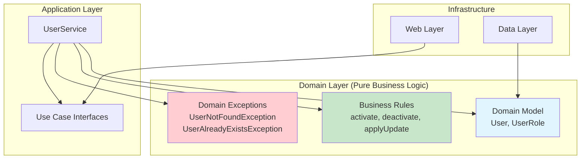
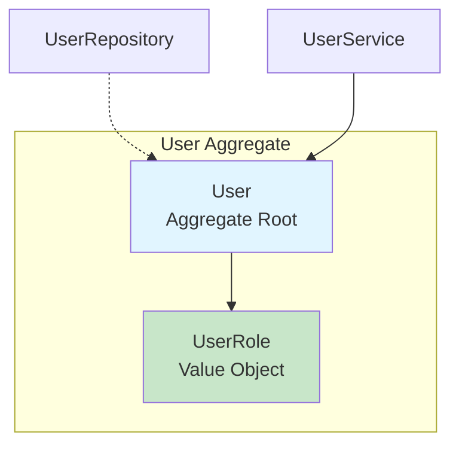
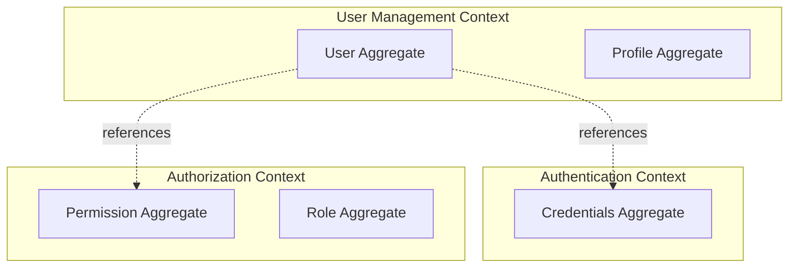
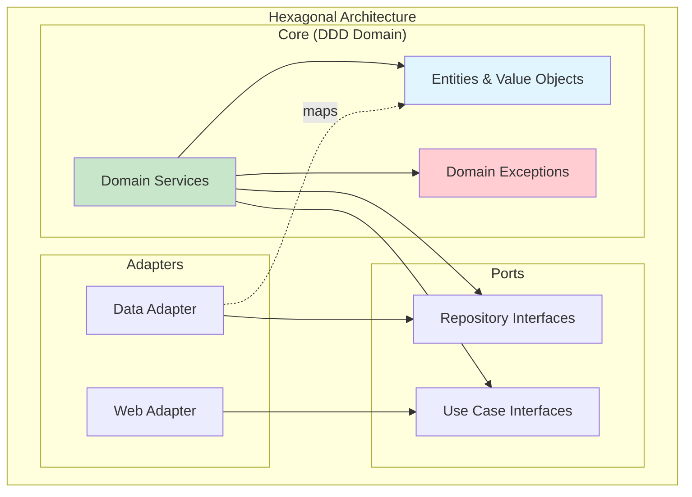

The User Management API applies **Domain-Driven Design (DDD)** principles to create a rich, expressive domain model that encapsulates business logic and rules. The domain is framework-agnostic and lives at the heart of the hexagonal architecture.

## What is Domain-Driven Design?

DDD is an approach to software development that focuses on:

1. **Understanding the business domain** - Collaborate with domain experts
2. **Modeling the domain** - Create objects that reflect business concepts
3. **Using a ubiquitous language** - Same terms in code as in business discussions
4. **Encapsulating business rules** - Logic lives in domain objects, not services



## Domain Model

The domain model represents core business concepts as pure Java classes.

### User Entity

The `User` class is the central domain entity:

```java
// src/main/java/com/fbaron/user/core/model/User.java
package com.fbaron.user.core.model;

import lombok.AllArgsConstructor;
import lombok.Builder;
import lombok.Getter;
import lombok.NoArgsConstructor;
import lombok.Setter;

import java.time.LocalDateTime;
import java.util.UUID;

/**
 * Core domain model representing a User.
 * Pure Java — no JPA, no Spring, no Framework Dependency.
 * This is the central business object of the User Management domain.
 */
@Getter
@Setter
@Builder
@NoArgsConstructor
@AllArgsConstructor
public class User {

    private UUID id;
    private String username;
    private String email;
    private String firstName;
    private String lastName;
    private UserRole role;
    private boolean active;
    private LocalDateTime createdAt;
    private LocalDateTime updatedAt;

    /** Activates the user. */
    public void activate() {
        this.active = true;
        this.updatedAt = LocalDateTime.now();
    }

    /** Deactivates the user (soft-delete). */
    public void deactivate() {
        this.active = false;
        this.updatedAt = LocalDateTime.now();
    }

    /**
     * Applies a partial update to this user, preserving immutable fields
     * (createdAt) and auto-setting updatedAt.
     */
    public void applyUpdate(String email, String firstName, String lastName, 
                           UserRole role, boolean active) {
        this.email = email;
        this.firstName = firstName;
        this.lastName = lastName;
        this.role = role;
        this.active = active;
        this.updatedAt = LocalDateTime.now();
    }
}
```

See: `src/main/java/com/fbaron/user/core/model/User.java:22`

<Note>
Notice this is **not** an anemic domain model (just getters/setters). The User entity encapsulates business behavior through methods like `activate()`, `deactivate()`, and `applyUpdate()`.
</Note>

**Key characteristics:**
- **Pure Java** - No JPA annotations, no Spring dependencies
- **Identity** - `UUID id` uniquely identifies each user
- **Rich behavior** - Methods that enforce business rules
- **Immutability awareness** - `createdAt` is never modified after creation
- **Automatic timestamps** - `updatedAt` is set automatically when state changes

### Value Objects

Value objects are immutable objects defined by their attributes, not identity.

#### UserRole Enum

```java
// src/main/java/com/fbaron/user/core/model/UserRole.java
package com.fbaron.user.core.model;

/**
 * Enumeration of valid user roles in the system.
 * Kept in the core domain to enforce role-based business rules 
 * at the service level.
 */
public enum UserRole {
    ADMIN,
    USER,
    GUEST
}
```

See: `src/main/java/com/fbaron/user/core/model/UserRole.java:7`

**Characteristics:**
- Defines valid roles for the domain
- Type-safe (can't assign invalid roles)
- Shared across all layers (web, core, data)
- Can be extended with methods if needed:

```java
public enum UserRole {
    ADMIN,
    USER,
    GUEST;
    
    public boolean canModifyUsers() {
        return this == ADMIN;
    }
    
    public boolean hasReadAccess() {
        return true; // All roles can read
    }
}
```

<Tip>
Enums are perfect value objects - they're immutable, type-safe, and can encapsulate behavior related to their values.
</Tip>

## Business Logic in the Domain

The domain model encapsulates business rules:

### Activation/Deactivation

Users can be activated or deactivated (soft delete):

```java
public void activate() {
    this.active = true;
    this.updatedAt = LocalDateTime.now();
}

public void deactivate() {
    this.active = false;
    this.updatedAt = LocalDateTime.now();
}
```

**Business rules:**
- Activation sets `active = true`
- Deactivation sets `active = false` (soft delete, not physical deletion)
- Both operations update the timestamp

**Usage in service:**

```java
@Override
public User register(User user) {
    // ... validation ...
    user.activate();  // Business logic in domain model
    return userCommandRepository.save(user);
}

@Override
public void removeById(UUID userId) {
    User existing = userQueryRepository.findById(userId)
            .orElseThrow(() -> new UserNotFoundException(userId));
    existing.deactivate();  // Business logic in domain model
    userCommandRepository.save(existing);
}
```

See: 
- `src/main/java/com/fbaron/user/core/service/UserService.java:26`
- `src/main/java/com/fbaron/user/core/service/UserService.java:78`

### Partial Updates

The `applyUpdate` method handles partial user updates:

```java
public void applyUpdate(String email, String firstName, String lastName, 
                       UserRole role, boolean active) {
    this.email = email;
    this.firstName = firstName;
    this.lastName = lastName;
    this.role = role;
    this.active = active;
    this.updatedAt = LocalDateTime.now();
}
```

**Business rules:**
- Only specified fields can be updated
- `username` is immutable (not included in update)
- `id` is immutable (never changes)
- `createdAt` is immutable (not included in update)
- `updatedAt` is automatically set to current time

**Usage in service:**

```java
@Override
public User edit(UUID userId, User user) {
    User existing = userQueryRepository.findById(userId)
            .orElseThrow(() -> new UserNotFoundException(userId));
    
    // Validation...
    
    // Business logic in domain model
    existing.applyUpdate(
        user.getEmail(),
        user.getFirstName(),
        user.getLastName(),
        user.getRole(),
        user.isActive()
    );
    
    return userCommandRepository.save(existing);
}
```

See: `src/main/java/com/fbaron/user/core/service/UserService.java:59`

<Note>
By encapsulating update logic in the domain model, we ensure business rules (like immutable fields) are enforced consistently across all use cases.
</Note>

## Domain Exceptions

Domain exceptions express business rule violations in the language of the domain.

### UserNotFoundException

Thrown when a requested user doesn't exist:

```java
// src/main/java/com/fbaron/user/core/exception/UserNotFoundException.java
package com.fbaron.user.core.exception;

import java.util.UUID;

/**
 * Thrown when a requested user cannot be located in the system.
 * Unchecked to avoid polluting use-case signatures with 
 * infrastructure noise.
 */
public class UserNotFoundException extends RuntimeException {

    private final UUID userId;

    public UserNotFoundException(UUID userId) {
        super("User not found with id: " + userId);
        this.userId = userId;
    }

    public UUID getUserId() {
        return userId;
    }
}
```

See: `src/main/java/com/fbaron/user/core/exception/UserNotFoundException.java:9`

**Usage:**

```java
public User findById(UUID id) {
    return userQueryRepository.findById(id)
            .orElseThrow(() -> new UserNotFoundException(id));
}
```

### UserAlreadyExistsException

Thrown when attempting to register a user with a duplicate username or email:

```java
// src/main/java/com/fbaron/user/core/exception/UserAlreadyExistsException.java
package com.fbaron.user.core.exception;

/**
 * Thrown when a registration or update violates a unique constraint
 * (username or email already taken).
 */
public class UserAlreadyExistsException extends RuntimeException {

    public UserAlreadyExistsException(String field, String value) {
        super("User already exists with " + field + " : " + value);
    }
}
```

See: `src/main/java/com/fbaron/user/core/exception/UserAlreadyExistsException.java:7`

**Usage:**

```java
public User register(User user) {
    if (userQueryRepository.existsByUsername(user.getUsername())) {
        throw new UserAlreadyExistsException("username", user.getUsername());
    }
    if (userQueryRepository.existsByEmail(user.getEmail())) {
        throw new UserAlreadyExistsException("email", user.getEmail());
    }
    // ... proceed with registration
}
```

<Tip>
Domain exceptions are unchecked (extend `RuntimeException`) to keep method signatures clean. They're caught and translated to HTTP responses by the global exception handler.
</Tip>

## Ubiquitous Language

The code uses the same terminology as business discussions:

| Business Term | Code Representation |
|---------------|---------------------|
| User | `User` class |
| Register a user | `RegisterUserUseCase.register()` |
| Edit a user | `EditUserUseCase.edit()` |
| Deactivate a user | `User.deactivate()` |
| User role | `UserRole` enum |
| User not found | `UserNotFoundException` |
| Duplicate user | `UserAlreadyExistsException` |

**Benefits:**
- Developers and domain experts speak the same language
- Code is self-documenting
- Business rules are explicit in the code
- Reduces translation errors between requirements and implementation

## Domain Services

When business logic doesn't naturally fit in an entity, it goes in a domain service:

```java
// src/main/java/com/fbaron/user/core/service/UserService.java
public class UserService implements RegisterUserUseCase, GetUserUseCase, 
                                     EditUserUseCase, RemoveUserUseCase {
    private final UserQueryRepository userQueryRepository;
    private final UserCommandRepository userCommandRepository;

    @Override
    public User register(User user) {
        // Cross-entity validation (doesn't belong in User entity)
        if (userQueryRepository.existsByUsername(user.getUsername())) {
            throw new UserAlreadyExistsException("username", user.getUsername());
        }
        if (userQueryRepository.existsByEmail(user.getEmail())) {
            throw new UserAlreadyExistsException("email", user.getEmail());
        }

        // Entity behavior
        user.activate();
        
        // Persistence
        return userCommandRepository.save(user);
    }
}
```

See: `src/main/java/com/fbaron/user/core/service/UserService.java:20`

**Domain service characteristics:**
- Coordinates between multiple domain objects
- Implements business logic that doesn't belong to a single entity
- Depends on repository interfaces (ports), not implementations
- No framework dependencies (pure business logic)

<Note>
The line between entity behavior and service behavior:
- **Entity**: Operations on a single instance (activate, deactivate, applyUpdate)
- **Service**: Cross-entity validation, orchestration, persistence coordination
</Note>

## Aggregates and Bounded Contexts

In this simple domain, `User` is both an entity and an aggregate root:



**Aggregate rules:**
- External objects access the aggregate through the root (User)
- Consistency boundaries - updates to a user are atomic
- Repository operates on aggregates, not individual value objects

**For a larger system**, you might have multiple aggregates:



Each bounded context has its own models and rules.

## Persistence Ignorance

The domain model has **no persistence concerns**:

**Domain Model (Clean):**
```java
public class User {
    private UUID id;
    private String username;
    // No @Entity, @Column, @Table annotations
}
```

**JPA Entity (In Data Layer):**
```java
@Entity
@Table(name = "users")
public class UserJpaEntity {
    @Id
    @GeneratedValue(strategy = GenerationType.UUID)
    private UUID id;
    
    @Column(nullable = false, length = 50)
    private String username;
    // All JPA annotations isolated here
}
```

See: `src/main/java/com/fbaron/user/data/jpa/entity/UserJpaEntity.java:39`

**Mapping between them:**
```java
public class UserJpaMapper {
    public User toModel(UserJpaEntity entity) {
        return User.builder()
                .id(entity.getId())
                .username(entity.getUsername())
                // ... map all fields
                .build();
    }

    public UserJpaEntity toEntity(User user) {
        return UserJpaEntity.builder()
                .id(user.getId())
                .username(user.getUsername())
                // ... map all fields
                .build();
    }
}
```

<Tip>
This separation allows you to:
- Test domain logic without a database
- Change persistence technology without touching domain code
- Keep domain model focused on business logic
</Tip>

## DDD in Hexagonal Architecture

DDD and hexagonal architecture complement each other:



- **DDD** defines the domain model (entities, value objects, domain services)
- **Hexagonal architecture** isolates the domain from infrastructure
- Together, they create a clean, testable, maintainable system

## Testing the Domain

Domain models are easy to test - no mocking required:

```java
class UserTest {
    @Test
    void activate_ShouldSetActiveToTrue() {
        User user = User.builder()
                .username("jdoe")
                .active(false)
                .build();
        
        user.activate();
        
        assertTrue(user.isActive());
        assertNotNull(user.getUpdatedAt());
    }
    
    @Test
    void deactivate_ShouldSetActiveToFalse() {
        User user = User.builder()
                .username("jdoe")
                .active(true)
                .build();
        
        user.deactivate();
        
        assertFalse(user.isActive());
        assertNotNull(user.getUpdatedAt());
    }
    
    @Test
    void applyUpdate_ShouldUpdateMutableFields() {
        User user = User.builder()
                .id(UUID.randomUUID())
                .username("jdoe")
                .email("old@example.com")
                .createdAt(LocalDateTime.now())
                .build();
        
        LocalDateTime originalCreatedAt = user.getCreatedAt();
        String originalUsername = user.getUsername();
        
        user.applyUpdate(
            "new@example.com",
            "Jane",
            "Doe",
            UserRole.ADMIN,
            true
        );
        
        // Immutable fields unchanged
        assertEquals(originalUsername, user.getUsername());
        assertEquals(originalCreatedAt, user.getCreatedAt());
        
        // Mutable fields updated
        assertEquals("new@example.com", user.getEmail());
        assertEquals("Jane", user.getFirstName());
        assertNotNull(user.getUpdatedAt());
    }
}
```

## Benefits of DDD

<CardGroup cols={2}>
  <Card title="Expressive Code" icon="comment">
    Code reads like business requirements - clear intent and purpose
  </Card>
  
  <Card title="Encapsulation" icon="lock">
    Business rules live in domain objects, not scattered across services
  </Card>
  
  <Card title="Testability" icon="vial">
    Pure domain logic can be tested without frameworks or databases
  </Card>
  
  <Card title="Maintainability" icon="wrench">
    Changes to business rules happen in one place - the domain model
  </Card>
</CardGroup>

## Related Topics

<CardGroup cols={2}>
  <Card title="Hexagonal Architecture" icon="hexagon" href="/architecture/hexagonal">
    See how DDD fits into ports and adapters pattern
  </Card>
  
  <Card title="CQRS Pattern" icon="split" href="/architecture/cqrs">
    Learn how domain models are persisted and retrieved
  </Card>
</CardGroup>
