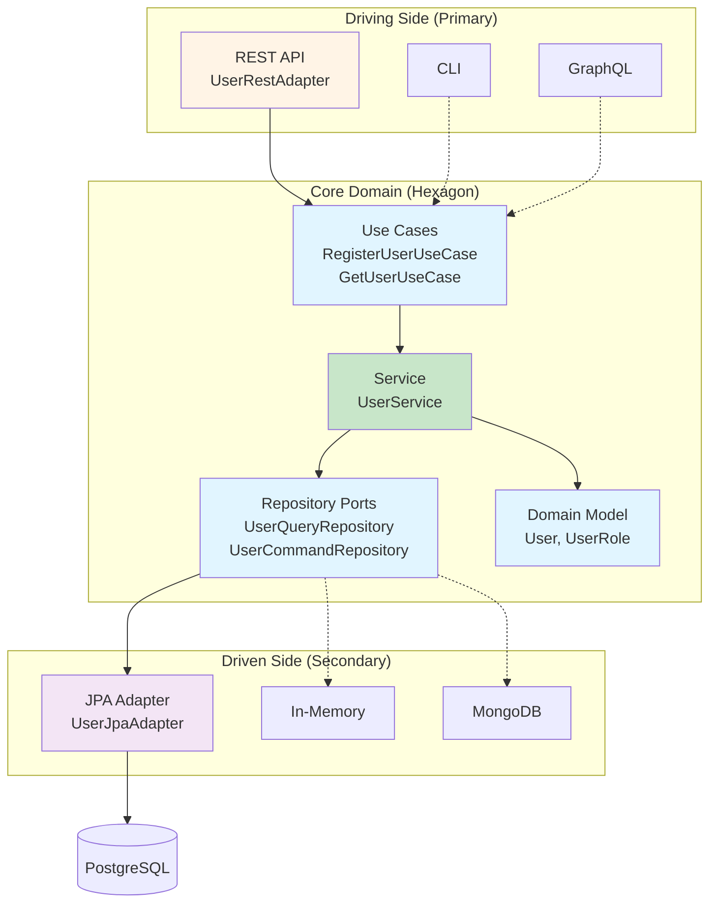
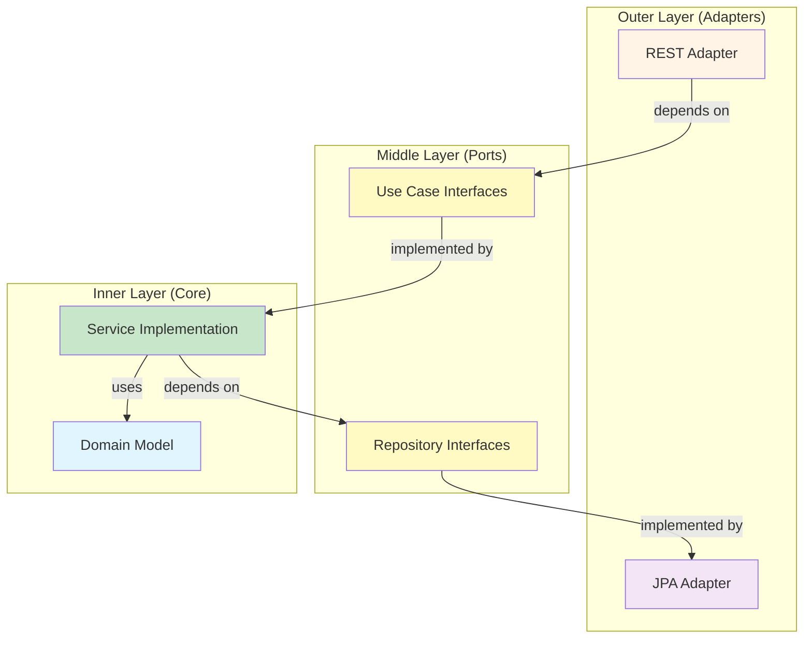

The User Management API implements **Hexagonal Architecture** (also known as Ports and Adapters pattern), which ensures that business logic remains isolated from external concerns like databases, web frameworks, and third-party services.

## What is Hexagonal Architecture?

Hexagonal architecture organizes code into three main areas:

1. **Core (Domain)** - Business logic and domain models
2. **Ports** - Interfaces defining how to interact with the core
3. **Adapters** - Concrete implementations of ports for specific technologies



<Note>
The hexagon shape is symbolic - it represents that the core can have any number of ports (not just 6). The key is that the core is at the center, isolated from external concerns.
</Note>

## Core Domain (The Hexagon)

The core contains pure business logic with **zero framework dependencies**. No Spring annotations, no JPA annotations, no web framework code.

### Domain Models

Pure Java classes representing business concepts:

```java
// src/main/java/com/fbaron/user/core/model/User.java
package com.fbaron.user.core.model;

@Getter
@Setter
@Builder
public class User {
    private UUID id;
    private String username;
    private String email;
    private String firstName;
    private String lastName;
    private UserRole role;
    private boolean active;
    private LocalDateTime createdAt;
    private LocalDateTime updatedAt;

    public void activate() {
        this.active = true;
        this.updatedAt = LocalDateTime.now();
    }

    public void deactivate() {
        this.active = false;
        this.updatedAt = LocalDateTime.now();
    }
}
```

See: `src/main/java/com/fbaron/user/core/model/User.java:22`

<Tip>
Notice the domain model has behavior (activate, deactivate) - this is rich domain modeling, not anemic data structures.
</Tip>

### Business Logic

Services implement business rules:

```java
// src/main/java/com/fbaron/user/core/service/UserService.java
public class UserService implements RegisterUserUseCase, GetUserUseCase {
    private final UserQueryRepository userQueryRepository;
    private final UserCommandRepository userCommandRepository;

    @Override
    public User register(User user) {
        // Business rule: username must be unique
        if (userQueryRepository.existsByUsername(user.getUsername())) {
            throw new UserAlreadyExistsException("username", user.getUsername());
        }
        
        // Business rule: email must be unique
        if (userQueryRepository.existsByEmail(user.getEmail())) {
            throw new UserAlreadyExistsException("email", user.getEmail());
        }

        user.activate();
        return userCommandRepository.save(user);
    }
}
```

See: `src/main/java/com/fbaron/user/core/service/UserService.java:20`

## Ports (Interfaces)

Ports define how the outside world interacts with the core. They are divided into two types:

### Driving Ports (Primary/Inbound)

Define what the application **can do** - exposed as use case interfaces:

```java
// src/main/java/com/fbaron/user/core/usecase/RegisterUserUseCase.java
public interface RegisterUserUseCase {
    /**
     * Creates and persists a new user with a generated unique ID.
     */
    User register(User user);
}
```

```java
// src/main/java/com/fbaron/user/core/usecase/GetUserUseCase.java
public interface GetUserUseCase {
    List<User> findAll();
    User findById(UUID id);
}
```

See: `src/main/java/com/fbaron/user/core/usecase/RegisterUserUseCase.java:10`

### Driven Ports (Secondary/Outbound)

Define what the application **needs** - repository interfaces for persistence:

```java
// src/main/java/com/fbaron/user/core/repository/UserQueryRepository.java
public interface UserQueryRepository {
    List<User> findAll();
    Optional<User> findById(UUID id);
    boolean existsByUsername(String username);
    boolean existsByEmail(String email);
    boolean existsByEmailAndIdNot(String email, UUID id);
}
```

```java
// src/main/java/com/fbaron/user/core/repository/UserCommandRepository.java
public interface UserCommandRepository {
    User save(User user);
}
```

See: 
- `src/main/java/com/fbaron/user/core/repository/UserQueryRepository.java:13`
- `src/main/java/com/fbaron/user/core/repository/UserCommandRepository.java:10`

<Note>
Ports are defined in the core module, ensuring the core controls its own interfaces. External adapters must conform to what the core needs, not vice versa.
</Note>

## Adapters (Implementations)

### Driving Adapters (Primary)

Adapters that **use** the core to expose functionality:

#### REST Adapter

Translates HTTP requests to use case calls:

```java
// src/main/java/com/fbaron/user/web/rest/UserRestAdapter.java
@RestController
@RequestMapping("/api/v1/users")
public class UserRestAdapter {
    private final RegisterUserUseCase registerUserUseCase;
    private final GetUserUseCase getUserUseCase;
    private final EditUserUseCase editUserUseCase;
    private final RemoveUserUseCase removeUserUseCase;
    private final UserDtoMapper userDtoMapper;

    @PostMapping
    public ResponseEntity<UserDto> registerUser(@Valid @RequestBody RegisterUserDto dto) {
        // 1. Map DTO to domain model
        var user = userDtoMapper.toModel(dto);
        
        // 2. Call use case
        var registeredUser = registerUserUseCase.register(user);
        
        // 3. Map domain model to DTO
        return ResponseEntity.status(HttpStatus.CREATED)
                .body(userDtoMapper.toDto(registeredUser));
    }
}
```

See: `src/main/java/com/fbaron/user/web/rest/UserRestAdapter.java:33`

**Responsibilities:**
- Receive HTTP requests
- Validate input (using `@Valid`)
- Map DTOs to domain models
- Call use cases
- Map results to DTOs
- Return HTTP responses

<Tip>
The REST adapter depends only on use case interfaces, never on concrete service implementations. This allows for easy testing with mocks.
</Tip>

### Driven Adapters (Secondary)

Adapters that **implement** ports required by the core:

#### JPA Adapter

Implements repository ports using Spring Data JPA:

```java
// src/main/java/com/fbaron/user/data/jpa/UserJpaAdapter.java
public class UserJpaAdapter implements UserQueryRepository, UserCommandRepository {
    private final UserJpaRepository userJpaRepository;
    private final UserJpaMapper userJpaMapper;

    @Override
    public List<User> findAll() {
        return userJpaRepository.findAllByActiveTrueOrderByCreatedAtDesc()
                .stream()
                .map(userJpaMapper::toModel)
                .toList();
    }

    @Override
    public Optional<User> findById(UUID id) {
        return userJpaRepository.findById(id)
                .map(userJpaMapper::toModel);
    }

    @Override
    public User save(User user) {
        UserJpaEntity entity = userJpaMapper.toEntity(user);
        UserJpaEntity saved = userJpaRepository.save(entity);
        return userJpaMapper.toModel(saved);
    }
}
```

See: `src/main/java/com/fbaron/user/data/jpa/UserJpaAdapter.java:26`

**Responsibilities:**
- Implement repository port interfaces
- Translate between domain models and JPA entities
- Interact with Spring Data JPA repository
- Handle persistence concerns (transactions, etc.)

## Boundary Translation

Data crosses boundaries through mappers to maintain isolation:

### DTO ↔ Domain Model

```java
// Web layer mapper
public class UserDtoMapper {
    public User toModel(RegisterUserDto dto) {
        return User.builder()
                .username(dto.username())
                .email(dto.email())
                .firstName(dto.firstName())
                .lastName(dto.lastName())
                .role(dto.role())
                .build();
    }

    public UserDto toDto(User user) {
        return new UserDto(
                user.getId(),
                user.getUsername(),
                user.getEmail(),
                user.getFirstName(),
                user.getLastName(),
                user.getRole(),
                user.getCreatedAt(),
                user.getUpdatedAt(),
                user.isActive()
        );
    }
}
```

### Domain Model ↔ JPA Entity

```java
// Data layer mapper
public class UserJpaMapper {
    public UserJpaEntity toEntity(User user) {
        return UserJpaEntity.builder()
                .id(user.getId())
                .username(user.getUsername())
                .email(user.getEmail())
                .firstName(user.getFirstName())
                .lastName(user.getLastName())
                .role(user.getRole())
                .active(user.isActive())
                .createdAt(user.getCreatedAt())
                .updatedAt(user.getUpdatedAt())
                .build();
    }

    public User toModel(UserJpaEntity entity) {
        return User.builder()
                .id(entity.getId())
                .username(entity.getUsername())
                .email(entity.getEmail())
                .firstName(entity.getFirstName())
                .lastName(entity.getLastName())
                .role(entity.getRole())
                .active(entity.isActive())
                .createdAt(entity.getCreatedAt())
                .updatedAt(entity.getUpdatedAt())
                .build();
    }
}
```

<Note>
Mappers prevent framework-specific annotations (like `@Entity` or `@JsonProperty`) from leaking into the core domain model.
</Note>

## Wiring It All Together

Spring configuration binds concrete implementations to interfaces:

```java
// src/main/java/com/fbaron/user/config/UserBeanConfiguration.java
@Configuration
public class UserBeanConfiguration {

    @Bean
    public UserService userService(
            UserQueryRepository userQueryRepository,
            UserCommandRepository userCommandRepository) {
        return new UserService(userQueryRepository, userCommandRepository);
    }

    @Bean
    public UserJpaAdapter userJpaAdapter(
            UserJpaRepository userJpaRepository,
            UserJpaMapper userJpaMapper) {
        return new UserJpaAdapter(userJpaRepository, userJpaMapper);
    }
}
```

See: `src/main/java/com/fbaron/user/config/UserBeanConfiguration.java:28`

<Tip>
This explicit wiring approach (vs. annotation scanning) makes the dependency graph visible and easier to reason about.
</Tip>

## Dependency Flow Rules

The architecture enforces strict dependency rules:



**Rules:**
1. Dependencies point **inward** (toward the core)
2. Core never depends on adapters
3. Adapters depend on port interfaces, not implementations
4. Core defines all interfaces it needs

## Benefits

<CardGroup cols={2}>
  <Card title="Testability" icon="vial">
    Test core logic without web servers or databases - just mock the interfaces
  </Card>
  
  <Card title="Flexibility" icon="arrows-rotate">
    Swap out adapters (REST → GraphQL, JPA → MongoDB) without touching core
  </Card>
  
  <Card title="Framework Independence" icon="shield">
    Core has no Spring, JPA, or web dependencies - pure business logic
  </Card>
  
  <Card title="Clear Boundaries" icon="border-all">
    Explicit interfaces make it obvious what the core needs and provides
  </Card>
</CardGroup>

## Example: Adding a New Adapter

Want to add GraphQL support? Just create a new driving adapter:

```java
@Controller
public class UserGraphQLAdapter {
    private final RegisterUserUseCase registerUserUseCase;
    private final GetUserUseCase getUserUseCase;
    
    @MutationMapping
    public User registerUser(@Argument RegisterUserInput input) {
        User user = // map input to domain model
        return registerUserUseCase.register(user);
    }
    
    @QueryMapping
    public List<User> users() {
        return getUserUseCase.findAll();
    }
}
```

No changes to core needed - just implement the same use case interfaces.

## Related Topics

<CardGroup cols={2}>
  <Card title="CQRS Pattern" icon="split" href="/architecture/cqrs">
    See how command/query separation optimizes data access
  </Card>
  
  <Card title="Domain-Driven Design" icon="cube" href="/architecture/domain-driven-design">
    Learn about domain models and business rules
  </Card>
</CardGroup>
