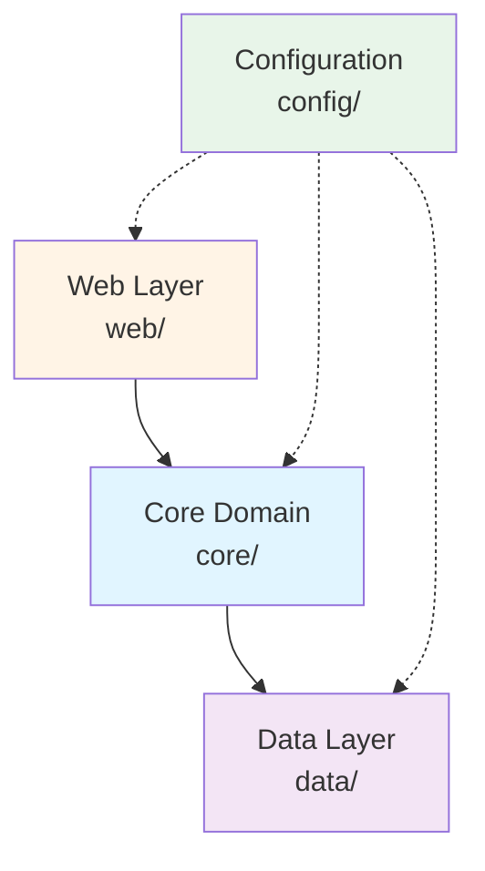
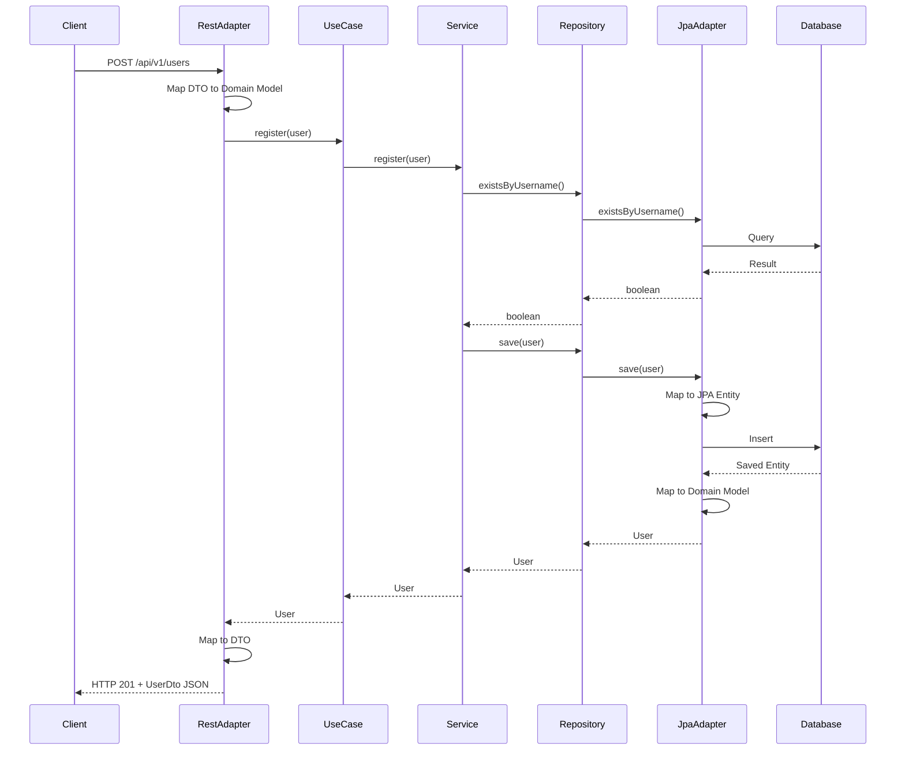
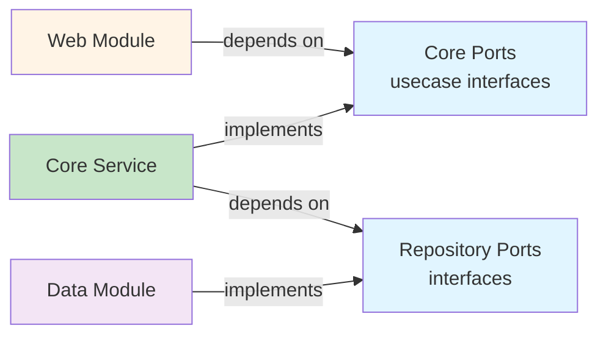

The User Management API is built with a clean, maintainable architecture that prioritizes testability, flexibility, and separation of concerns. This page provides a high-level overview of the architectural decisions and design patterns used throughout the application.

## Architectural Style

The application follows **Hexagonal Architecture** (also known as Ports and Adapters), combined with **Domain-Driven Design** principles and **CQRS** pattern for data access optimization.

<Note>
Hexagonal architecture ensures that business logic remains independent of frameworks, databases, and external services, making the system highly testable and adaptable to change.
</Note>

## Module Structure

The codebase is organized into four main modules, each with distinct responsibilities:



### Core Module (`core/`)

The heart of the application containing pure business logic:

- **`model/`** - Domain entities and value objects (e.g., `User`, `UserRole`)
- **`usecase/`** - Use case interfaces defining application capabilities
- **`service/`** - Business logic implementations
- **`repository/`** - Repository port interfaces (abstractions)
- **`exception/`** - Domain-specific exceptions

**Key characteristic**: Framework-agnostic. No Spring, JPA, or web framework dependencies.

See: `src/main/java/com/fbaron/user/core/`

### Web Module (`web/`)

The driving adapter that exposes REST endpoints:

- **`rest/`** - REST controllers/adapters (e.g., `UserRestAdapter`)
- **`dto/`** - Data Transfer Objects for HTTP requests/responses
- **`mapper/`** - Mappers between DTOs and domain models

**Responsibility**: Translate HTTP requests to use case calls and map responses to JSON.

See: `src/main/java/com/fbaron/user/web/rest/UserRestAdapter.java:33`

### Data Module (`data/`)

The driven adapter implementing persistence:

- **`jpa/`** - JPA implementation of repository ports
  - `UserJpaAdapter` - Implements both query and command repositories
  - `entity/` - JPA entities (e.g., `UserJpaEntity`)
  - `mapper/` - Mappers between JPA entities and domain models
  - `repository/` - Spring Data JPA repositories

**Responsibility**: Persist and retrieve domain models using PostgreSQL.

See: `src/main/java/com/fbaron/user/data/jpa/UserJpaAdapter.java:26`

### Configuration Module (`config/`)

Spring configuration and cross-cutting concerns:

- **`UserBeanConfiguration`** - Wires hexagonal architecture components
- **`exception/GlobalExceptionHandler`** - Centralized error handling
- **`openapi/OpenApiConfig`** - Swagger/OpenAPI configuration

**Responsibility**: Dependency injection, bean wiring, and application setup.

See: `src/main/java/com/fbaron/user/config/UserBeanConfiguration.java:28`

## Design Patterns

The architecture employs multiple complementary patterns:

<CardGroup cols={2}>
  <Card title="Hexagonal Architecture" icon="hexagon" href="/architecture/hexagonal">
    Ports and adapters pattern for clean separation between core and infrastructure
  </Card>
  
  <Card title="CQRS Pattern" icon="split" href="/architecture/cqrs">
    Command/Query separation for optimized read and write operations
  </Card>
  
  <Card title="Domain-Driven Design" icon="cube" href="/architecture/domain-driven-design">
    Rich domain models with business logic and domain exceptions
  </Card>
  
  <Card title="Use Case Pattern" icon="diagram-project">
    Explicit interfaces defining application capabilities (e.g., `RegisterUserUseCase`)
  </Card>
</CardGroup>

### Additional Patterns

**Repository Pattern**
Abstract data access through interfaces defined in the core module:
- `UserQueryRepository` - Read operations
- `UserCommandRepository` - Write operations

**Mapper Pattern**
Translate between boundary objects and domain models:
- `UserDtoMapper` - Web layer ↔ Domain model
- `UserJpaMapper` - Domain model ↔ JPA entity

**Builder Pattern**
Domain models use Lombok's `@Builder` for immutable object construction:

```java
User user = User.builder()
    .username("jdoe")
    .email("jdoe@example.com")
    .firstName("John")
    .lastName("Doe")
    .role(UserRole.USER)
    .build();
```

## Request Flow

Here's how a typical request flows through the architecture:



<Tip>
Notice how dependencies always point inward toward the core domain. The core never depends on web or data modules, ensuring business logic remains pure and testable.
</Tip>

## Dependency Flow

The architecture follows the **Dependency Inversion Principle** (DIP):



**Key points:**
- Web layer depends on use case interfaces (not implementations)
- Core service depends on repository interfaces (not implementations)
- Data layer implements repository interfaces
- All dependencies point toward abstractions

## Benefits of This Architecture

<CardGroup cols={2}>
  <Card title="Testability" icon="vial">
    Business logic can be tested with simple mocks, no framework required
  </Card>
  
  <Card title="Maintainability" icon="wrench">
    Clear separation of concerns makes code easy to understand and modify
  </Card>
  
  <Card title="Flexibility" icon="arrows-rotate">
    Infrastructure can be changed without affecting business rules (swap databases, add GraphQL, etc.)
  </Card>
  
  <Card title="Framework Independence" icon="shield">
    Core domain has no Spring, JPA, or web framework dependencies
  </Card>
</CardGroup>

## Technology Stack

- **Framework**: Spring Boot 3.x
- **Language**: Java 21
- **Database**: PostgreSQL with Spring Data JPA
- **API Documentation**: OpenAPI 3.0 (Swagger)
- **Migration**: Flyway
- **Build Tool**: Gradle

## Next Steps

Explore the detailed architecture patterns:

<CardGroup cols={2}>
  <Card title="Hexagonal Architecture" icon="hexagon" href="/architecture/hexagonal">
    Learn about ports, adapters, and the core domain
  </Card>
  
  <Card title="CQRS Pattern" icon="split" href="/architecture/cqrs">
    Understand command/query separation
  </Card>
  
  <Card title="Domain-Driven Design" icon="cube" href="/architecture/domain-driven-design">
    Explore domain models and business rules
  </Card>
</CardGroup>
